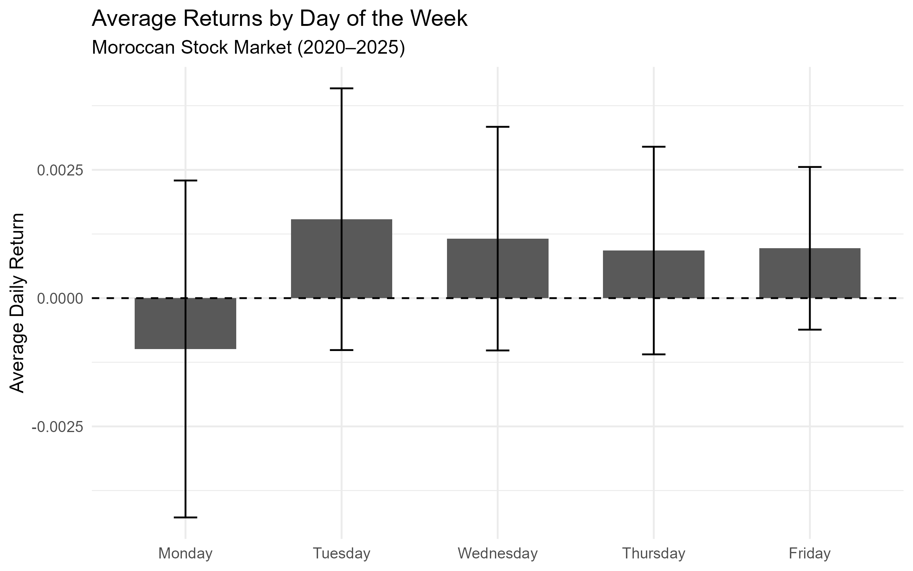
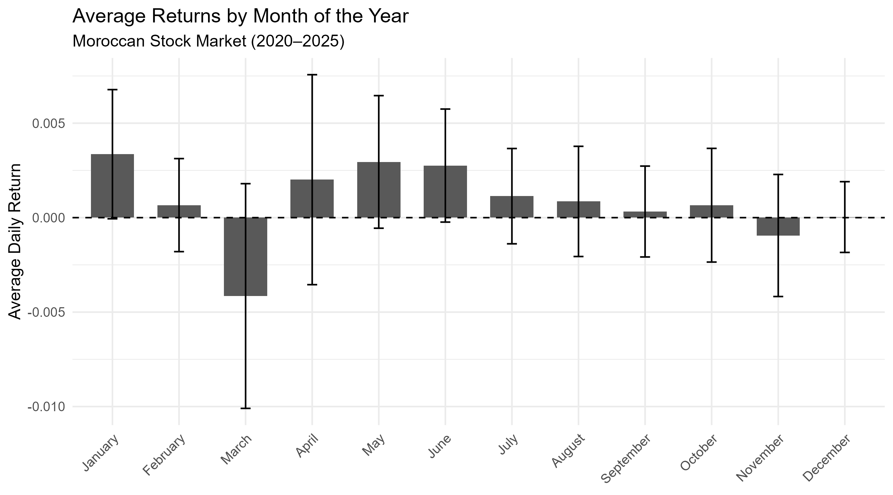

# Calendar Anomalies in the Moroccan Stock Market

An empirical analysis of **day-of-the-week** and **month-of-the-year** effects in the Moroccan stock market over the period **2020–2025**.

The project investigates whether stock returns exhibit systematic calendar patterns that could challenge the weak-form Efficient Market Hypothesis.

## 📌 Overview
Calendar anomalies refer to recurring patterns in financial returns associated with particular days, months, or periods of the year. This project examines two common calendar effects in the Moroccan stock market:

- **Day-of-the-Week (DOW) Effect**
- **Month-of-the-Year (MOY) Effect**

The analysis uses daily returns from **15 Moroccan listed stocks** to construct an equally weighted market return and tests whether average returns vary systematically across trading days and calendar months.

## 🎯 Research Objective
1. Do average stock returns differ across the days of the week?
2. Do average stock returns differ across months of the year?
3. Are the observed differences statistically significant after accounting for heteroskedasticity and autocorrelation?

## 📊 Data
- **Market:** Moroccan stock market
- **Period:** 2020–2025
- **Frequency:** Daily
- **Number of stocks:** 15
- **Market return:** Equally weighted average return of the selected stocks

The dataset used for the analysis is located in the `data/` directory.

## 🔬 Methodology
### 1. Day-of-the-Week Effect
Dummy variables are created for each trading day:

- Monday
- Tuesday
- Wednesday
- Thursday
- Friday

The model is estimated without an intercept so that each coefficient directly represents the average return for the corresponding trading day:

$$
R_t =
\beta_{\text{Mon}}D_{\text{Mon},t}
+\beta_{\text{Tue}}D_{\text{Tue},t}
+\beta_{\text{Wed}}D_{\text{Wed},t}
+\beta_{\text{Thu}}D_{\text{Thu},t}
+\beta_{\text{Fri}}D_{\text{Fri},t}
+\varepsilon_t
$$
where:

Rt = market return on day t

$$
D_{j,t} =
\begin{cases}
1, & \text{if day } t \text{ corresponds to weekday } j \\
0, & \text{otherwise}
\end{cases}
$$

and βj represents the average daily return for weekday j.


### 2. Month-of-the-Year Effect

A similar specification is estimated using twelve monthly dummy variables:

$$
R_t = \sum_{m=1}^{12}\beta_m D_{m,t}+\varepsilon_t
$$
where:

$$
D_{m,t} =
\begin{cases}
1, & \text{if day } t \text{ corresponds to month } m \\
0, & \text{otherwise}
\end{cases}
$$

and βm represents the average daily return during month m.

Each coefficient therefore represents the estimated average daily return for that month.

### 3. Market Return Construction
The equally weighted market return is constructed as:

$$
R_{m,t}=\frac{1}{N}\sum_{i=1}^{N}R_{i,t},
\qquad N=15
$$
where Ri,t is the return of stock i on day t.

### 4. Robust Inference

To account for potential violations of standard OLS assumptions in financial return data, inference is conducted using:

- **HC1 heteroskedasticity-consistent standard errors**
- **Newey–West HAC standard errors**

This provides a robustness check for the statistical significance of the detected calendar patterns.

## 📈 Main Results
### Day-of-the-Week Effect

Average returns differ descriptively across trading days. **Monday records a negative average return**, while the other trading days exhibit positive average returns.

However, the coefficients are **not statistically significant at conventional significance levels** after robust inference.

The results therefore provide **no strong statistical evidence of a day-of-the-week anomaly** during the sample period.

### Month-of-the-Year Effect

Monthly returns show greater descriptive variation.

- **January** records a relatively high positive average return.
- **March** records the most pronounced negative average return.
- Several other months, particularly **May and June**, display positive average returns.

Under HC1 inference, January, May, and June show marginal evidence at the 10% level. Under the more conservative Newey–West specification, only January remains marginally significant at approximately the 10% level.

Overall, the evidence for a persistent month-of-the-year effect is therefore **weak rather than conclusive**.

## 📊 Visualizations
### Average Returns by Day of the Week



### Average Returns by Month of the Year



## 🛠️ Repository Structure

## 🛠️ Repository Structure

```text
MASI-Calendar-Anomalies/
│
├── code/
│   └── calendar_anomalies_analysis.R
│
├── data/
│   └── Finance comportementale.xlsx
│
├── figures/
│   ├── day_of_week_returns.png
│   └── month_of_year_returns.png
│
├── results/
│   ├── DOW_HC1_results.csv
│   ├── DOW_NeweyWest_results.csv
│   ├── MOY_HC1_results.csv
│   └── MOY_NeweyWest_results.csv
│
├── .gitignore
├── LICENSE
└── README.md
```

## 📚 Reproducibility
The complete empirical analysis is available in:

```text
code/calendar_anomalies_analysis.R
```

The script performs the workflow from data import and preparation through dummy-variable construction, econometric estimation, robust inference, result export, and visualization.

### Required R Packages

```r
library(readxl)
library(dplyr)
library(lubridate)
library(lmtest)
library(sandwich)
library(ggplot2)
```

After cloning the repository and installing the required packages, run:

```r
source("code/calendar_anomalies_analysis.R")
```
## 📑 Conclusion
The analysis identifies visible differences in Moroccan stock returns across trading days and months between 2020 and 2025. However, most of these differences do not remain statistically significant once robust inference is applied.

The results consequently provide **limited evidence of persistent calendar anomalies** in the selected sample, illustrating the importance of distinguishing descriptive return patterns from statistically robust market anomalies.

## 🧕 Author
**Btissam Bouhou**
Master's in Finance des Marchés et Trading  
Morocco

## References
Alloul, F., & Ferrouhi, E. (2025). Calendar Anomalies in African Stock Markets:
Does the Effect of Covid-19 Pandemic Matter? *Organizations and Markets in
Emerging Economies, 16*(1), 155–192.
https://doi.org/10.15388/omee.2025.16.7

## License
This project is available under the terms specified in the repository's `LICENSE` file.
